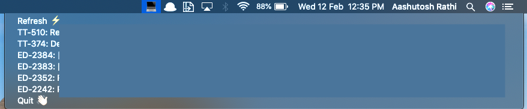

# Jira ToDo

A simple menu bar app which helps you in keeping track of your Jira tickets 🎟.

It opens the issue on click and also you can update them with the refresh button.

### Preview (masked sensitive content)



## Configuration

Create a `todo-app.json` file in your home directory.

```sh
cd ~
touch todo-app.json
nano todo-app.json
```

and make an object similar to this

```json
{
  "user": "you@company.com",
  "apikey": "YOUR-API-KEY",
  "server": "https://<COMPANY>.atlassian.net"
}
```

Get your API key from [Manage API Keys](https://id.atlassian.com/manage/api-tokens)

## Download (Currently not working)

Get the latest app from [release section](https://github.com/aashutoshrathi/Jira-Todo-MenubarApp/releases)

## Build and Run locally

- Clone the repo
- Install pipenv using `pip install -U pipenv`
- Create new Virtual Env using `pipenv shell`
- Install dependencies using `pipenv install`
- Build with development hook using `python3 setup.py py2app -A`
- Run the `Jira Todo.app` file in `dist/`

## Developement Setup

- Install pipenv using `pip install -U pipenv`
- Create new Virtual Env using `pipenv shell`
- Install dependencies using `pipenv install`
- Change the `app.py` to tweak with app.
- Build using `python3 setup.py py2app`

### Thanks

Special Thanks to [Ridiculously Uncomplicated macOS Python Statusbar apps](https://github.com/jaredks/rumps) for making this fun.

### Author

Aashutosh Rathi (https://aashutosh.dev)
